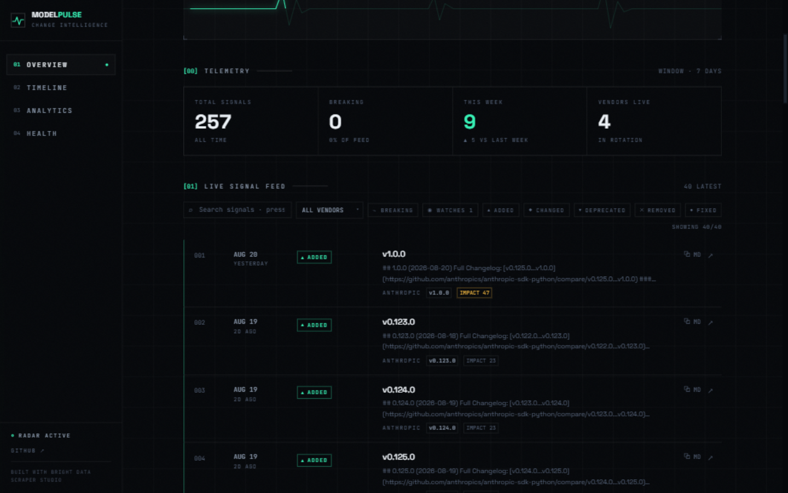
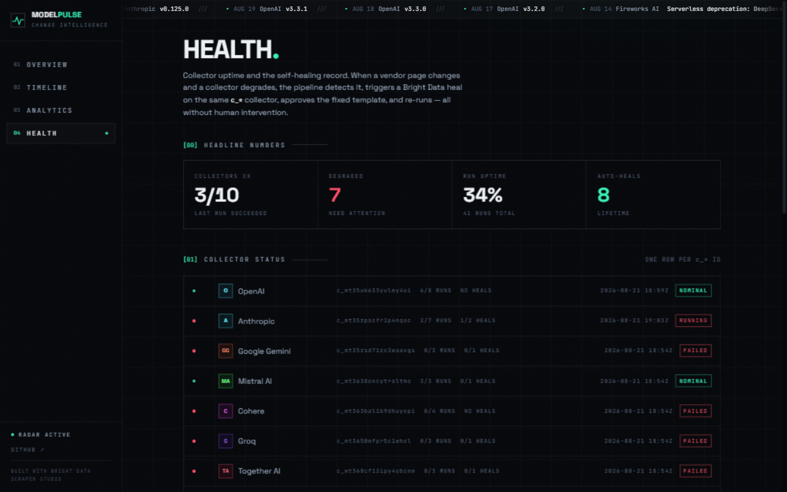

# ModelPulse — AI API Change Intelligence

> Catch breaking changes in AI vendor APIs before your code does.

ModelPulse watches **15 public AI vendor changelog pages daily**, normalizes them into a single schema, and alerts you on Slack/Discord the moment a breaking change ships. When a vendor redesigns their page, the pipeline **auto-heals itself** — no code change, no redeployment. Built for the [Scrape-Verse Hackathon](https://www.wemakedevs.org/hackathons/scrape-verse) with [Bright Data Scraper Studio](https://brightdata.com).



---

## The problem

AI vendors (OpenAI, Anthropic, Mistral, Cohere, Groq, ...) ship breaking changes weekly:

- Model deprecations
- Parameter removals
- API endpoint changes
- New authentication requirements

Most developers find out from their error logs, not from the vendor. By then, production is already down.

### "Why not just subscribe to each vendor's RSS / email?"

Because subscribing isn't the problem — **normalizing, scoring, and acting** is. The 15-second answer:

1. **Half these vendors have no feed at all.** Mistral, Cohere, Groq, Together, Fireworks, Replicate publish changelogs as plain HTML pages. There is nothing to subscribe to.
2. **Even where feeds exist, they're unstructured marketing prose.** No `change_type`, no breaking flag, no version. ModelPulse normalizes every vendor into one schema (`added/changed/deprecated/removed/fixed` + a 0–100 impact score) so machines can act on it, not just humans read it.
3. **Feeds only tell you what's new — never what was *edited*.** Vendors silently rewrite published entries. ModelPulse diffs every field on every scrape and flags silent edits (the ↻ EDITED badge).
4. **Feeds can't fail your CI build.** The point isn't reading changelogs — it's `npm run check-breaking` gating your deploy, webhooks firing into Slack, and one queryable API across all vendors.

And when a vendor redesigns their page (which kills every naive scraper *and* every homegrown RSS-to-X hack), Scraper Studio heals the collector in place. That's the part no feed subscription can ever give you.

## The solution

A self-healing pipeline of Bright Data collectors that:

1. Scrapes 15 public AI vendor changelog pages daily (+ optional GitHub Releases per vendor)
2. Normalizes them into one schema (SQLite), scored with a 0–100 **impact rating**
3. Diffs week-over-week, flags new changes **and detects silent edits** to old ones
4. Alerts via Slack/Discord/generic **webhooks** — optionally filtered by your **keyword watches**
5. Exposes **RSS feeds** and a public **JSON API**, so CI can fail builds on breaking changes
6. **Self-heals automatically** when a vendor changes their changelog page layout — detects breakage, triggers `bdata scraper heal`, and re-runs. Same `c_*` collector ID, no downstream code change, no human intervention

## Live demo

- **Dashboard:** [modelpulse-ruby.vercel.app](https://modelpulse-ruby.vercel.app) — the daily workflow commits the
  updated SQLite database back to this repo, so a deployed dashboard always reads fresh data with full
  history. Deploy your own with `cd dashboard && npx vercel`.
- **Demo video:** [Watch on YouTube](https://youtube.com) _(link updated at submission)_
- **Slack alert sample:** [`examples/slack-alert-sample.json`](./examples/slack-alert-sample.json)
- **Real self-healing transcript:** [`docs/live-heal-log.md`](./docs/live-heal-log.md) — actual API calls, actual collector ID, actual fix
- **Self-healing at a glance:** the dashboard's `/health` page shows collector uptime and the full auto-heal history

---

## How Bright Data Scraper Studio is used

ModelPulse is built on **15 independent Scraper Studio collectors**, one per AI vendor. Each was created with a single `bdata scraper create` command:

```bash
bdata scraper create https://platform.openai.com/docs/changelog \
  "Extract every changelog entry. For each entry: title, version, date (YYYY-MM-DD), change_type (one of: added, changed, deprecated, removed, fixed), description, url. Skip navigation, footer, hero sections, and any non-changelog content."
```

Bright Data's AI Agent wrote the scraper code, returned a stable `c_*` collector ID, and from then on we've been calling that ID like an API:

```bash
bdata scraper run c_openai_xxx https://platform.openai.com/docs/changelog --pretty
```

For the full list of all 10 collectors and the exact creation prompts, see [`scripts/create-collectors.sh`](./scripts/create-collectors.sh).

### The three CLI commands at the heart of ModelPulse

| Command | What it does | How ModelPulse uses it |
|---------|--------------|------------------------|
| `bdata scraper create` | Generate a scraper from a URL + natural-language description | One-time per vendor; creates our 10 collectors |
| `bdata scraper run` | Execute a scraper on a URL and return structured data | Called by `npm run scrape` against all 10 collectors |
| `bdata scraper heal` | Fix an existing scraper in place via AI self-healing | Called automatically by the daily cron when a collector fails, returns 0 rows, or shows partial breakage — or on demand via `npm run heal -- <vendor> "what broke"` |

Under the hood, the CLI maps to these Bright Data HTTP endpoints:
- `POST /dca/collector` + `POST /dca/collectors/{c_*}/automate_template` (create / regenerate template)
- `POST /dca/trigger` + `GET /dca/dataset?id=j_*` (run)
- `POST /dca/collectors/{id}/refactor_template` with `{"prompt": ...}` (heal)
- `GET /dca/collectors/{id}/refactor_template/progress` (poll until the job reaches its approval gate)
- `POST /dca/collectors/{id}/resume_automation_job` with `{"message": true, "auto_save": true}` (approve)

See [`src/brightdata.ts`](./src/brightdata.ts) for our direct-HTTP client that calls these endpoints without the CLI (so it runs in GitHub Actions without an interactive login).

### Self-healing — the headline feature

When a vendor redesigns their changelog page, our scraper starts returning null or partial data. We fix it in place with:

```bash
bdata scraper heal c_mistral_xxx \
  "The change_type field returns null since they restructured. Look for the new 'category' label and use its value."

bdata scraper approve c_mistral_xxx
```

**The `c_*` ID stays the same across heals.** No downstream code changes. See [`docs/self-healing.md`](./docs/self-healing.md) for the full demo transcript.

#### The automated loop (production)

`npm run scrape` runs the full detect → heal → approve → re-run loop without any human step:

1. **Detect** — a collector that errors, returns **0 rows**, or returns rows where a required field (`title`, `date`, `change_type`) is missing from the majority of entries is flagged. That last check catches *partial breakage*: the classic post-redesign failure where rows still come back but the fields have quietly gone null.
2. **Cooldown** — a vendor gets one repair attempt per window (20h for heals, 48h for template regeneration) instead of burning credits every day. Unlike a count-based breaker it self-recovers when the window passes, and a heal job still running server-side (HTTP 409) is adopted — polled and approved — rather than duplicated. Visible on the `/health` dashboard page.
3. **Heal** — `POST /dca/collectors/{id}/refactor_template` with a reason describing what broke.
4. **Wait** — poll the collector until the AI refactor reports finished, so we never approve a half-written template.
5. **Approve & re-run** — approve the healed template and re-run the same `c_*` collector (up to 2 attempts), with results upserted as usual.

Every attempt is recorded in the `heals` table and rendered on the dashboard's `/health` page:



That screenshot is from a real run: detection fired on real failure signals (a 502 timeout, a "Collector does not have a template" 403, and genuine partial breakage — 29/29 rows missing `change_type`), and the heal loop approved a real fix (`ia_mt3bcpnuo5ux6zu0k`) against the same `c_*` collector ID.

---

## Architecture

```
┌─────────────────────────────────────────────────────────────┐
│                  GitHub Actions (cron)                      │
│                  daily 09:00 UTC                            │
└─────────────────────┬───────────────────────────────────────┘
                      │
                      ▼
         ┌────────────────────────────┐
         │  src/cli.ts scrape         │
         │  - Loop over 10 collectors │
         │  - POST /dca/trigger       │
         │  - Poll /dca/dataset       │
         └────────────┬───────────────┘
                      │ raw JSON per vendor
                      ▼
         ┌────────────────────────────┐
         │  src/normalize.ts          │
         │  Vendor-agnostic schema:   │
         │  vendor, title, version,   │
         │  date, change_type,        │
         │  is_breaking, url          │
         └────────────┬───────────────┘
                      │
                      ▼
         ┌────────────────────────────┐
         │  SQLite (data/modelpulse.db)│
         │  changes, runs             │
         └────────────┬───────────────┘
                      │
                      ▼
         ┌────────────────────────────┐
         │  src/diff.ts               │
         │  Week-over-week comparison │
         │  Flag new + breaking       │
         └────────────┬───────────────┘
                      │
                      ▼
         ┌────────────────────────────┐
         │  src/alert.ts              │
         │  POST Slack / Discord hook │
         └────────────────────────────┘

The Next.js dashboard reads from the same SQLite database:
  /                → This week, all vendors
  /vendor/[slug]   → All changes for one vendor
  /timeline        → Visual timeline grouped by date
  /stats           → Top vendors, breaking-change frequency
  /health          → Collector health + auto-heal history
```

---

## Quick start

### Prerequisites
- Node.js 20+ ([nodejs.org](https://nodejs.org))
- A free [Bright Data](https://brightdata.com) account (5,000 credits/month, no card required)
- Apply promo code **`wemakedevs`** in Billing for an extra $50 in credits
- A Slack incoming webhook URL (optional, for alerts) — get one at `https://api.slack.com/messaging/webhooks`
- A GitHub account (for free Actions cron + Vercel-style deploy)

### One-command setup

```bash
git clone https://github.com/rajkumarpawar07/modelpulse.git modelpulse
cd modelpulse
bash scripts/setup.sh
```

The setup script will:
1. Install Node deps
2. Verify `bdata login`
3. Create all missing Scraper Studio collectors (≈15 min)
4. Write `.env` from the template
5. Run the first scrape so you can see the pipeline working

### Manual setup (if you prefer)

```bash
# 1. Install
npm install

# 2. Log in to Bright Data
npx -p @brightdata/cli bdata login

# 3. Configure
cp .env.example .env
# Edit .env: set BRIGHT_DATA_API_KEY and (optionally) SLACK_WEBHOOK_URL

# 4. Create the 10 collectors
bash scripts/create-collectors.sh
# → writes collectors.json with 10 c_* IDs

# 5. Run the full pipeline
npm run all
# → scrape → normalize → diff → alert

# 6. Start the dashboard
cd dashboard
npm install
npm run dev
# → open http://localhost:3000
```

### Useful commands

```bash
npm run scrape        # Run all collectors (4 in parallel), auto-heal broken ones
npm run diff          # Compute the week-over-week diff
npm run alert         # Send the alert to Slack/Discord/webhook
npm run all           # Full pipeline: scrape → diff → alert
npm run watch -- add "rate limit"   # add a keyword watch
npm run watch -- list               # list / remove watches
npm run heal -- mistral "what broke" # on-demand heal (production code path)
npm run seed          # Populate demo data without scraping
npm run demo:heal     # Guided self-healing demo (runs real commands, nothing staged)
npm test              # Run unit tests (Vitest)
npm run typecheck     # TypeScript validation
```

Tuning knobs (all optional env vars): `SCRAPE_CONCURRENCY` (default 4),
`SCRAPE_TIMEOUT_MS` (default 300000), `HEAL_RERUN_ATTEMPTS` (default 2),
`HEAL_COOLDOWN_HOURS` (default 20), `REGEN_COOLDOWN_HOURS` (default 48).

---

## Capabilities

### RSS feeds

Subscribe from any RSS reader, Slack feed app, or automation tool:

- All vendors: **`/feed`**
- Per vendor: **`/feed/openai`**, `/feed/anthropic`, … (any vendor slug)

### Public JSON API

Everything the dashboard shows, available to scripts and integrations:

```
GET /api/changes?limit=100&breaking=true&since=2026-08-14&vendor=openai&type=deprecated
```

| Param | Values | Default |
|---|---|---|
| `limit` | 1–500 | 50 |
| `vendor` | vendor slug (e.g. `openai`) | all |
| `type` | added · changed · deprecated · removed · fixed | all |
| `since` | YYYY-MM-DD | — |
| `breaking` | `true` for breaking-only | false |

CORS is enabled — call it from anywhere.

### Keyword watches

Watch only what you care about:

```bash
npm run watch -- add "rate limit"
npm run watch -- add deprecat
npm run watch -- remove "rate limit"   # or by id
npm run watch -- list
```

Set `ALERT_WATCH_ONLY=true` in `.env` so alerts fire only on watch matches. The dashboard highlights matching entries with a ◉ tag and adds a WATCHES filter pill.

### Impact scoring

Every change gets a deterministic 0–100 severity score — change type + breaking flag + risk keywords (auth, pricing, rate-limit, deprecation…). Shown as IMPACT badges in the dashboard and stored in the `impact` column for sorting/analytics. See [`src/impact.ts`](./src/impact.ts).

### Structured diffing (mutation detection)

Changelog entries get edited after publication — silently. Every scrape compares each entry field-by-field against what we stored; edits are recorded into the `change_diffs` table (field, old → new), the row gets an `updated_at`, and the dashboard flags edited entries with an ↻ EDITED badge.

### Multi-source ingestion (GitHub Releases) — optional, off by default

ModelPulse focuses on **AI API changelog changes** — that is what the impact scoring, breaking-change
flags, and alerts are built for. If you *also* want a vendor's SDK release notes, add
`"github_repo": "owner/name"` to that vendor's entry in `collectors.json` and releases flow through
the same normalizer. No vendor ships with it enabled; set `ENABLE_GITHUB=false` to force changelog-only.

### Generic webhooks (Zapier / Make / n8n)

Set `WEBHOOK_URL` in `.env` to receive structured JSON alerts (sample: [`examples/webhook-payload.json`](./examples/webhook-payload.json)):

```json
{
  "event": "modelpulse.alert",
  "is_breaking": true,
  "count": 3,
  "changes": [ { "title": "...", "impact": 88, "...": "..." } ]
}
```

Works with Zapier's *Catch Hook*, Make custom webhooks, n8n, or your own endpoint.

### CI: fail builds on breaking changes

Drop this into any repo that builds on AI vendor APIs — sample workflow in [`examples/modelpulse-check.yml`](./examples/modelpulse-check.yml). Vendor `ci/check-breaking.mjs` into your repo (the sample workflow explains how) so CI never executes remote code:

```bash
node check-breaking.mjs
# env:
#   MODEL_PULSE_URL    — your ModelPulse instance
#   MODEL_PULSE_DAYS   — look-back window (default 7)
#   MODEL_PULSE_VENDOR — optional vendor filter slug
#   MODEL_PULSE_MODE   — fail (exit 1) | warn (::warning)
```

Exits non-zero if breaking changes shipped within the window — catch drift before deploy, not after.

---

## Repository structure

```
modelpulse/
├── README.md                          # you are here
├── LICENSE                            # MIT
├── package.json                       # Node deps + scripts
├── tsconfig.json                      # TypeScript config
├── collectors.json                    # 10 c_* collector IDs
├── .env.example                       # template (copy to .env)
├── .gitignore
├── vitest.config.ts                   # test config
├── src/                               # Node.js + TypeScript backend
│   ├── types.ts                       # unified Change schema
│   ├── db.ts                          # SQLite wrapper + watches + mutation diffing
│   ├── brightdata.ts                  # Scraper Studio HTTP client
│   ├── normalize.ts                   # vendor-agnostic schema
│   ├── impact.ts                      # 0-100 severity scoring
│   ├── diff.ts                        # week-over-week diff engine
│   ├── alert.ts                       # Slack/Discord/webhook dispatcher
│   ├── cli.ts                         # the main entry point (+ watch & heal commands)
│   └── sources/
│       └── github.ts                  # GitHub Releases source adapter
├── dashboard/                         # Next.js 14 dashboard ("SIGNAL" mission-control UI)
│   ├── app/
│   │   ├── page.tsx                   # / — overview + live feed
│   │   ├── health/page.tsx           # /health — collector uptime + heal history
│   │   ├── timeline/page.tsx          # /timeline
│   │   ├── stats/page.tsx             # /stats — risk index, WoW verdict
│   │   ├── vendor/[slug]/page.tsx     # /vendor/openai, etc.
│   │   ├── feed/route.ts              # RSS (all vendors)
│   │   ├── feed/[vendor]/route.ts     # RSS per vendor
│   │   ├── api/changes/route.ts       # public JSON API
│   │   └── layout.tsx
│   ├── components/
│   │   ├── SignalFeed.tsx             # filterable feed (search/vendor/type/watches)
│   │   ├── SignalRow.tsx              # log row + copy-as-markdown + badges
│   │   ├── Sidebar.tsx                # mission-control nav
│   │   ├── Ticker.tsx                 # scrolling latest-signals ticker
│   │   └── ui.tsx                     # HUD panels, sigils, chips
│   ├── lib/
│   │   ├── db.ts                      # read-only DB access
│   │   ├── read.ts                    # guarded data readers
│   │   └── rss.ts                     # RSS XML builder
│   └── package.json
├── ci/
│   └── check-breaking.mjs             # CI gate: fail builds on breaking changes
├── scripts/
│   ├── create-collectors.sh           # wrapper → create-collectors.ts (merge-safe)
│   ├── create-collectors.ts           # creates collectors via the direct API
│   ├── setup.sh                       # one-command bootstrap
│   ├── demo-heal.sh                   # self-healing demo (real commands, nothing staged)
│   ├── seed-data.sh                   # populate demo data
│   └── seed.ts                        # the seed script
├── .github/workflows/
│   └── daily-scrape.yml               # cron: 09:00 UTC daily
├── src/tests/                         # unit tests (Vitest)
│   ├── normalize.test.ts
│   ├── impact.test.ts
│   ├── diff.test.ts
│   ├── alert.test.ts
│   ├── heal.test.ts                   # partial-breakage detection
│   ├── db.test.ts                     # upsert + mutation diffing
│   └── brightdata.test.ts             # dataset unwrapping
├── docs/
│   ├── architecture.md
│   ├── self-healing.md                # the demo transcript
│   ├── live-heal-log.md               # real heal transcript (actual API calls)
│   ├── why-modelpulse.md
│   ├── screenshot-dashboard.png       # overview page, real data
│   └── screenshot-health.png          # /health — collector status + heal log
├── examples/
│   ├── openai-sample.json
│   ├── anthropic-sample.json
│   ├── mistral-sample.json
│   ├── all-vendors-this-week.json
│   ├── slack-alert-sample.json
│   ├── webhook-payload.json           # generic webhook sample (Zapier/Make)
│   └── modelpulse-check.yml           # CI workflow sample for consumer repos
├── raw/                               # ← raw scrape outputs (debug)
└── data/                              # ← SQLite DB lives here
```

---

## AI tool disclosure

This project was built with the assistance of **Claude Code** (Sonnet 4.5), using the official [Bright Data `scraper-studio` skill](https://github.com/brightdata/skills). AI assistance was used to:

- Scaffold the Next.js dashboard
- Write the diff and normalize logic
- Generate JSON example outputs and the seed script

All architectural decisions, scraper design choices, vendor selection, prompt engineering, and product trade-offs were made by the project author. The Bright Data collector prompts in `scripts/create-collectors.sh` were written and refined manually to handle the specific structure of each vendor's changelog page.

---

## License

MIT — see [LICENSE](./LICENSE).

## Acknowledgments

- [Bright Data](https://brightdata.com) for Scraper Studio and the `bdata` CLI
- [WeMakeDevs](https://www.wemakedevs.org) for hosting the Scrape-Verse Hackathon
- The 10 AI vendors whose public changelogs make this project possible
